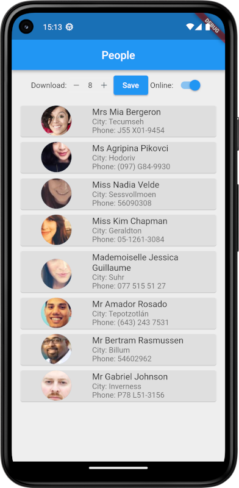
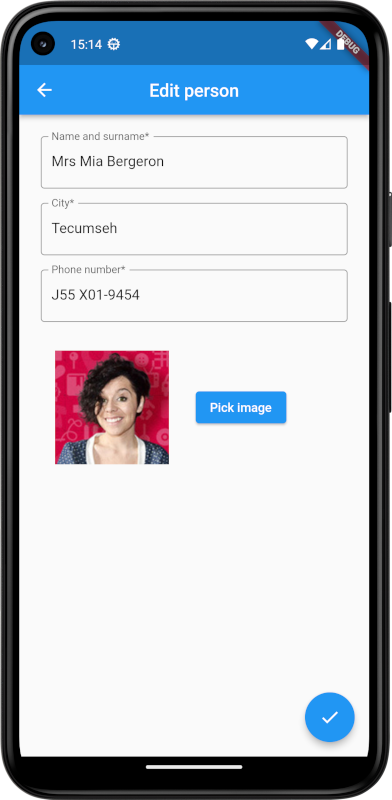
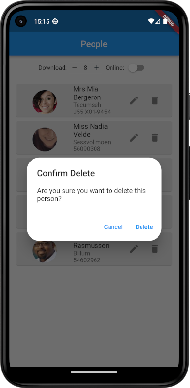

# Table of contents
* [General info](#general-info)
* [Technologies](#technologies)
* [Setup project](#setup-project)
* [Functional Requirements](#functional-requirements)
* [Aplication preview](#aplication-preview)
  
# General info
### Flutter Users App 
Flutter Users App is an application that allows to retrieve users data from RandomUser. The application stores information such as name, surname, city, phone number and user avatar. Data is saved in an SQLite database.

# Technologies
Flutter | Dart | SQLite

# Setup project
1. Clone repository.
2. It is recommended to run the application using for example Android Studio:
   - To launch the application: select the device and click 'Run' Icon.  

# Functional Requirements
### Main functionalities of the application: 
* **Downloading users data:** The user can specify the number of people whose data is to be downloaded. The application allows you to download new data from the website, when is refreshed - the application downloads randomly generated data from RandomUser each time.
* **Showing users data:** Allows you to view a list of users. In addition, the user can specify the number of people whose data is to be retrieved.
* **Offline mode:** In offline mode, the user can view user data stored in the local database. The application in this mode provides:
   - adding a new person,
   - editing existing people,
   - deleting people.

# Aplication preview
### Home screen of the application - Online mode

### Home screen of the application - offline mode

### Screen showing editing of an existing person 

### Screen showing deletion of an existing person 

